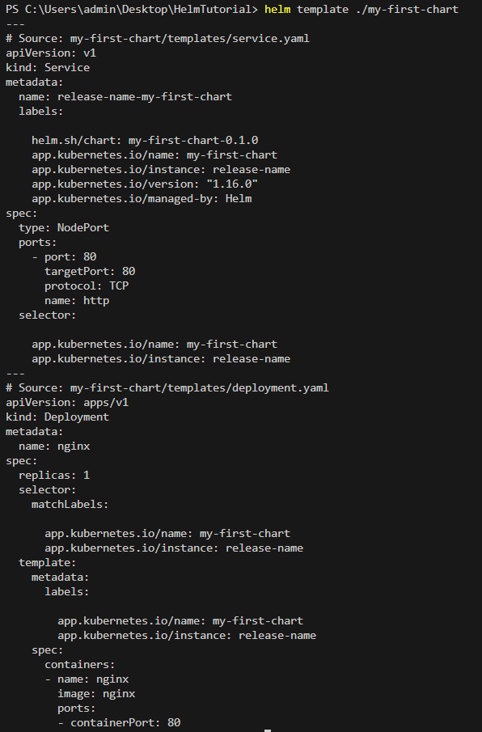
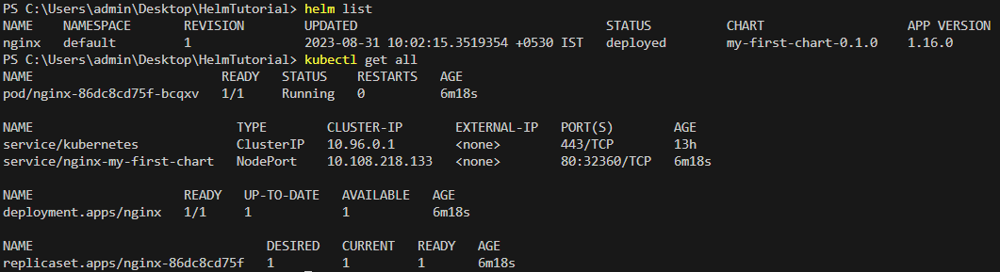

# Introduction to Helm

Helm is a tool that automates the creation, packaging, configuration, and deployment of Kubernetes applications by combining your configuration files into a single reusable package.

**Prerequisites**

The following prerequisites are required for a successful and properly secured use of Helm.

* A Kubernetes cluster
* Deciding what security configurations to apply to your installation, if any
* Installing and configuring Helm.

## We need a Kubernetes cluster

* You must have Kubernetes installed. For the latest release of Helm, we recommend the latest stable release of Kubernetes, which in most cases is the second-latest minor release.
* You should also have a local configured copy of kubectl.

# Getting Started with Helm

* [**Install Helm**](#install-helm)
* [**Create our first Chart**](#create-our-first-chart)
* [**Cleanup the template**](#cleanup-the-template)
* [**Add Kubernetes files to our new Chart**](#add-kubernetes-files-to-our-new-chart)
* [**Test the rendering of our template**](#test-the-rendering-of-our-template)
* [**Install our app using our Chart**](#install-our-app-using-our-chart)
* [**Delete the Installed Release**](#delete-the-installed-release)

## Install Helm

Helm now has an installer script that will automatically grab the latest version of Helm and install it locally.

You can fetch that script, and then execute it locally. It's well documented so that you can read through it and understand what it is doing before you run it.

```
curl -fsSL -o get_helm.sh https://raw.githubusercontent.com/helm/helm/main/scripts/get-helm-3
chmod 700 get_helm.sh
./get_helm.sh

```

**Through Package Managers**

The Helm community provides the ability to install Helm through operating system package managers. These are not supported by the Helm project and are not considered trusted 3rd parties.

**From Homebrew (macOS)**

Members of the Helm community have contributed a Helm formula build to Homebrew. This formula is generally up to date.

```
brew install helm
```

**From Chocolatey (Windows)**

Members of the Helm community have contributed a Helm package build to Chocolatey. This package is generally up to date.

```
choco install kubernetes-helm
```

**From Scoop (Windows)**

Members of the Helm community have contributed a Helm package build to Scoop. This package is generally up to date.

```
scoop install helm
```

**From Apt (Debian/Ubuntu)**

Members of the Helm community have contributed a Helm package for Apt. This package is generally up to date.

```
curl https://baltocdn.com/helm/signing.asc | gpg --dearmor | sudo tee /usr/share/keyrings/helm.gpg > /dev/null
sudo apt-get install apt-transport-https --yes
echo "deb [arch=$(dpkg --print-architecture) signed-by=/usr/share/keyrings/helm.gpg] https://baltocdn.com/helm/stable/debian/ all main" | sudo tee /etc/apt/sources.list.d/helm-stable-debian.list
sudo apt-get update
sudo apt-get install helm
```

## Create our first Chart

To create a new chart:

```

helm create my-first-chart

```

This command will create a new directory called my-first-chart with the structure and files of a basic chart.

## Cleanup the template 

When you first create a chart, it comes with a few example templates. Navigate to the templates directory inside your chart

* delete everything under /templates, keeping only `_helpers.tpl`,`deployment.yaml`,`service.yaml`
* delete `tests` folder under `templates`

## Add Kubernetes files to our new Chart

* Add deployment.yaml

```markdown
apiVersion: apps/v1
kind: Deployment
metadata:
  name: nginx
spec:
  replicas: {{ .Values.replicaCount }}
  selector:
    matchLabels:
      {{ include "my-first-chart.selectorLabels" . | nindent 6 }}
  template:
    metadata:
      labels:
        {{ include "my-first-chart.selectorLabels" . | nindent 8 }}
    spec:
      containers:
      - name: {{ .Values.container.name }}
        image: {{ .Values.image.repository }}
        ports:
        - containerPort: {{ .Values.service.targetPort }}
```

* Add service.yaml

```markdown
apiVersion: v1
kind: Service
metadata:
  name: {{ include "my-first-chart.fullname" . }}
  labels:
    {{ include "my-first-chart.labels" . | nindent 4 }}
spec:
  type: {{ .Values.service.type }}
  ports:
    - port: {{ .Values.service.port }}
      targetPort: {{ .Values.service.targetPort }}
      protocol: TCP
      name: http
  selector:
    {{ include "my-first-chart.selectorLabels" . | nindent 4 }}
```

* Add values.yaml

```markdown
replicaCount: 1

image:
  repository: nginx

service:
  type: NodePort
  port: 80
  name: nginx
  targetPort: 80

container:
  name: nginx
```

## Test the rendering of our template

It's always a good idea to test the rendering of your templates before you apply them. This is done with the helm template command:

```
helm template ./my-first-chart
```

This will output the rendered Kubernetes manifests to the console. If there are any errors, Helm will notify you.

## Install our app using our Chart

```
helm install nginx .\my-first-chart\
```

Replace `nginx` with a name of your choice for the release.



```
# list our releases

helm list

# see our deployed components

kubectl get all
```


## Delete the Installed Release

To delete the release named my-release-name that you've previously installed, run:

```
helm uninstall nginx
```

`nginx` is name you released.