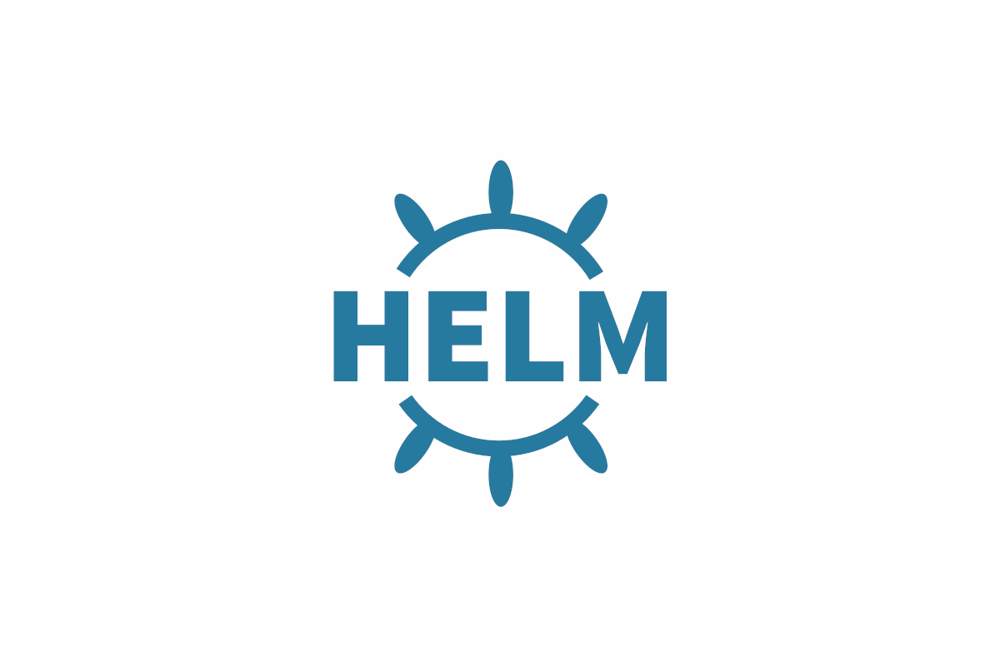
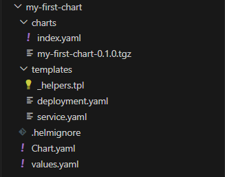

# Helm



# Table of contents

* [**Introduction to Helm**](#introduction-to-helm)
* [**Getting Started with Helm**](#getting-started-with-helm)
* [**Deploying single microservice**](#deploying-single-microservice)
* [**Deploying multiple microservice**](#deploying-multiple-microservice)
* [**Deploying using umbrella chart**](#deploying-using-umbrella-chart)
* [**Reference**](#reference)

# Introduction to Helm

Helm is a tool that automates the creation, packaging, configuration, and deployment of Kubernetes applications by combining your configuration files into a single reusable package.

**Prerequisites**

The following prerequisites are required for a successful and properly secured use of Helm.

* A Kubernetes cluster
* Deciding what security configurations to apply to your installation, if any
* Installing and configuring Helm.

## We need a Kubernetes cluster

* You must have Kubernetes installed. For the latest release of Helm, we recommend the latest stable release of Kubernetes, which in most cases is the second-latest minor release.
* You should also have a local configured copy of kubectl.

# Getting Started with Helm

* [**Install Helm**](#install-helm)
* [**Create our first Chart**](#create-our-first-chart)
* [**Cleanup the template**](#cleanup-the-template)
* [**Add Kubernetes files to our new Chart**](#add-kubernetes-files-to-our-new-chart)
* [**Test the rendering of our template**](#test-the-rendering-of-our-template)
* [**Install our app using our Chart**](#install-our-app-using-our-chart)
* [**Delete the Installed Release**](#delete-the-installed-release)

## Install Helm

Helm now has an installer script that will automatically grab the latest version of Helm and install it locally.

You can fetch that script, and then execute it locally. It's well documented so that you can read through it and understand what it is doing before you run it.

```
curl -fsSL -o get_helm.sh https://raw.githubusercontent.com/helm/helm/main/scripts/get-helm-3
chmod 700 get_helm.sh
./get_helm.sh

```

**Through Package Managers**

The Helm community provides the ability to install Helm through operating system package managers. These are not supported by the Helm project and are not considered trusted 3rd parties.

**From Homebrew (macOS)**

Members of the Helm community have contributed a Helm formula build to Homebrew. This formula is generally up to date.

```
brew install helm
```

**From Chocolatey (Windows)**

Members of the Helm community have contributed a Helm package build to Chocolatey. This package is generally up to date.

```
choco install kubernetes-helm
```

**From Scoop (Windows)**

Members of the Helm community have contributed a Helm package build to Scoop. This package is generally up to date.

```
scoop install helm
```

**From Apt (Debian/Ubuntu)**

Members of the Helm community have contributed a Helm package for Apt. This package is generally up to date.

```
curl https://baltocdn.com/helm/signing.asc | gpg --dearmor | sudo tee /usr/share/keyrings/helm.gpg > /dev/null
sudo apt-get install apt-transport-https --yes
echo "deb [arch=$(dpkg --print-architecture) signed-by=/usr/share/keyrings/helm.gpg] https://baltocdn.com/helm/stable/debian/ all main" | sudo tee /etc/apt/sources.list.d/helm-stable-debian.list
sudo apt-get update
sudo apt-get install helm
```

## Create our first Chart

To create a new chart:

```

helm create my-first-chart

```

This command will create a new directory called my-first-chart with the structure and files of a basic chart.

## Cleanup the template 

When you first create a chart, it comes with a few example templates. Navigate to the templates directory inside your chart

* delete everything under /templates, keeping only `_helpers.tpl`,`deployment.yaml`,`service.yaml`
* delete `tests` folder under `templates`

## Add Kubernetes files to our new Chart

* Add deployment.yaml

```markdown
apiVersion: apps/v1
kind: Deployment
metadata:
  name: nginx
spec:
  replicas: {{ .Values.replicaCount }}
  selector:
    matchLabels:
      {{ include "my-first-chart.selectorLabels" . | nindent 6 }}
  template:
    metadata:
      labels:
        {{ include "my-first-chart.selectorLabels" . | nindent 8 }}
    spec:
      containers:
      - name: {{ .Values.container.name }}
        image: {{ .Values.image.repository }}
        ports:
        - containerPort: {{ .Values.service.targetPort }}
```

* Add service.yaml

```markdown
apiVersion: v1
kind: Service
metadata:
  name: {{ include "my-first-chart.fullname" . }}
  labels:
    {{ include "my-first-chart.labels" . | nindent 4 }}
spec:
  type: {{ .Values.service.type }}
  ports:
    - port: {{ .Values.service.port }}
      targetPort: {{ .Values.service.targetPort }}
      protocol: TCP
      name: http
  selector:
    {{ include "my-first-chart.selectorLabels" . | nindent 4 }}
```

* Add values.yaml

```markdown
replicaCount: 1

image:
  repository: nginx

service:
  type: NodePort
  port: 80
  name: nginx
  targetPort: 80

container:
  name: nginx
```

## Test the rendering of our template

It's always a good idea to test the rendering of your templates before you apply them. This is done with the helm template command:

```
helm template ./my-first-chart
```

This will output the rendered Kubernetes manifests to the console. If there are any errors, Helm will notify you.

## Install our app using our Chart

```
helm install nginx .\my-first-chart\
```

Replace `nginx` with a name of your choice for the release.


```
# list our releases

helm list

# see our deployed components

kubectl get all
```


## Delete the Installed Release

To delete the release named nginx that you've previously installed, run:

```
helm uninstall nginx
```

This command will delete all deployment and services installed.

# Host Helm Charts on GitHub Pages

You can host Helm charts on GitHub Pages. It's a simple, cost-effective way to maintain and serve Helm charts. Here's a step-by-step guide:

**1. Create a GitHub Repository**

* Create a new repository on GitHub.
* Clone the repository locally:

```
git clone https://github.com/your-username/repo-name.git
```

**2. Initialize Helm in the Repository**

Navigate to the cloned directory and either create a new Helm chart or add existing ones:

```
helm package . -d .\charts\  

# .\charts\ - path-to-your-chart

# This will create a .tgz package of your chart in the directory.
```

A "package" refers to a compressed, tarred chart that has been prepared for distribution. It bundles all the essential details of a Helm chart into a single, versioned artifact, making it easy to share and deploy

**3. Create or Update the index file**

If this is your first time, you'll need to create an index file. Otherwise, you'll update the existing one:

```
# change directory to chart folder

cd .\charts\

helm repo index .

# This will generate (or update) an index.yaml file in your directory.
```



**4. Push to GitHub**

```
git add .
git commit -m "Add new chart"
git push origin main  # or `master` if your default branch is master
```

**5. Setup GitHub Pages**

* Go to the settings of your repository on GitHub.
* Navigate to the GitHub Pages section.
* Set the source branch to main or master.
* Your Helm repository is now available at https://your-username.github.io/repo-name/.

**6. Add the Repository to Helm**

```
helm repo add my-charts https://your-username.github.io/repo-name/
```

**7. Update and Search**

Whenever you make changes, remember to update the Helm repo:

```
helm repo update
helm search repo my-charts
```

And that's it! Your Helm charts are now hosted on GitHub Pages. Whenever you update your charts, remember to package the charts, update the index.yaml file, and push the changes to GitHub.

# Deploying single microservice

Deploying a **todoapi** using an H2 database on a Kubernetes cluster via Helm requires multiple steps, from creating the application, Dockerizing it, pushing the Docker image to a registry, creating a Helm chart.

Here's a step-by-step guide to deploying your todoapi with an H2 database using helm chart.

**1. Create a New Chart**

This command will create a new directory called TodoApi_H2 with the structure and files of a basic chart.

```
helm create TodoApi_H2
```

When you first create a chart, it comes with a few example templates. Navigate to the templates directory inside your chart

* delete everything under /templates, keeping only `_helpers.tpl`,`deployment.yaml`,`service.yaml`
* delete `tests` folder under `templates`

**2. Add Kubernetes files to our new Chart**

* Add deployment.yaml

```markdown
apiVersion: apps/v1
kind: Deployment
metadata:
  name: todo-api-h2
spec:
  replicas: {{ .Values.replicaCount }}
  selector:
    matchLabels:
      {{ include "TodoApi_H2.selectorLabels" . | nindent 6 }}
  template:
    metadata:
      labels:
        {{ include "TodoApi_H2.selectorLabels" . | nindent 8 }}
    spec:
      containers:
      - name: {{ .Values.container.name }}
        image: {{ .Values.image.repository }}
        ports:
        - containerPort: {{ .Values.service.targetPort }}
```

* Add service.yaml

```markdown
apiVersion: v1
kind: Service
metadata:
  name: {{ include "TodoApi_H2.fullname" . }}
  labels:
    {{ include "TodoApi_H2.labels" . | nindent 4 }}
spec:
  type: {{ .Values.service.type }}
  ports:
    - port: {{ .Values.service.port }}
      targetPort: {{ .Values.service.targetPort }}
      protocol: TCP
      name: http
  selector:
    {{ include "TodoApi_H2.selectorLabels" . | nindent 4 }}
```

* Add values.yaml

```markdown
replicaCount: 1

image:
  repository: vijaynvb/todoapih2:1.0

service:
  type: NodePort
  port: 80
  name: svctodoh2api
  targetPort: 80

container:
  name: todoapi-h2
```

**3. Install our app using our Chart**

```
helm install todoapi .\TodoApi_H2\ 

# see our deployed components

kubectl get all
``` 

Your **todoapi** using H2 should now be running in a pod within your Kubernetes cluster!

**4. packaging the helm chart**

A "package" refers to a compressed, tarred chart that has been prepared for distribution. It bundles all the essential details of a Helm chart into a single, versioned artifact, making it easy to share and deploy.

```
# change directory to helm chart folder
cd .\TodoApi_H2\

# package command and save it in chart folder
helm package . -d .\charts\  
```

**5. Creating the Chart Repository Index**

A chart repository is an HTTP server that houses one or more chart packages. Each chart repository can have its own index.yaml file that contains information about available charts in that repository.

```
# change directory to helm chart folder
cd .\TodoApi_H2\

# index command
helm repo index .\charts\  
```

# Deploying multiple microservice

In this example we will deploy two service **mysql** and **todoapi**

* [**Deploy mysql**](#deploy-mysql)
* [**Deploy TodoApi**](#deploy-todoapi)

## Deploy mysql

Deploying a **mysql** database on a Kubernetes cluster via Helm.

Here's a step-by-step guide to deploying your mysql database using helm chart.

**1. Create a New Chart**

This command will create a new directory called mysql with the structure and files of a basic chart.

```
helm create mysql
```

When you first create a chart, it comes with a few example templates. Navigate to the templates directory inside your chart

* delete everything under /templates, keeping only `_helpers.tpl`,`deployment.yaml`,`service.yaml`
* delete `tests` folder under `templates`

**2. Add Kubernetes files to our new Chart**

* Add deployment.yaml

```markdown
apiVersion: apps/v1
kind: Deployment
metadata:
  name: mysql
spec:
  replicas: {{ .Values.replicaCount }}
  selector:
    matchLabels:
      {{ include "mysql.selectorLabels" . | nindent 6 }}
  template:
    metadata:
      labels:
        {{ include "mysql.selectorLabels" . | nindent 8 }}
    spec:
      containers:
      - name: {{ .Values.container.name }}
        image: {{ .Values.image.repository }}
        env:
        - name: {{ .Values.env1.name }}
          value: {{ .Values.env1.value }}
        - name: {{ .Values.env2.name }}
          value: {{ .Values.env2.value }}
        ports:
        - containerPort: {{ .Values.service.targetPort }}
```

* Add service.yaml

```markdown
apiVersion: v1
kind: Service
metadata:
  name: {{ include "mysql.fullname" . }}
  labels:
    {{ include "mysql.labels" . | nindent 4 }}
spec:
  type: {{ .Values.service.type }}
  ports:
    - port: {{ .Values.service.port }}
      targetPort: {{ .Values.service.targetPort }}
      protocol: TCP
      name: http
  selector:
    {{ include "mysql.selectorLabels" . | nindent 4 }}
```

* Add values.yaml

```markdown
replicaCount: 1

image:
  repository: mysql

service:
  type: NodePort
  port: 3306
  targetPort: 3306

container:
  name: mysql

env1:
  name: MYSQL_DATABASE
  value: tododb

env2:
  name: MYSQL_ROOT_PASSWORD
  value: password
```

**3. packaging the helm chart**

A "package" refers to a compressed, tarred chart that has been prepared for distribution. It bundles all the essential details of a Helm chart into a single, versioned artifact, making it easy to share and deploy.

```
# change directory to helm chart folder
cd .\mysql\

# package command and save it in chart folder
helm package . -d .\charts\  
```

**4. Creating the Chart Repository Index**

A chart repository is an HTTP server that houses one or more chart packages. Each chart repository can have its own index.yaml file that contains information about available charts in that repository.

```
# change directory to helm chart folder
cd .\mysql\

# index command
helm repo index .\charts\  
```

## Deploy TodoApi

Deploying a **todoapi** using mysql database on a Kubernetes cluster via Helm.

Here's a step-by-step guide to deploying your todoapi using mysql database using helm chart.

**1. Create a New Chart**

This command will create a new directory called todoapp with the structure and files of a basic chart.

```
helm create todoapp
```

When you first create a chart, it comes with a few example templates. Navigate to the templates directory inside your chart

* delete everything under /templates, keeping only `_helpers.tpl`,`deployment.yaml`,`service.yaml`
* delete `tests` folder under `templates`

**2. Add Kubernetes files to our new Chart**

* Add deployment.yaml

```markdown
apiVersion: apps/v1
kind: Deployment
metadata:
  name: {{ .Release.Name }}
spec:
  replicas: {{ .Values.replicaCount }}
  selector:
    matchLabels:
      {{ include "todoapp.selectorLabels" . | nindent 6 }}
  template:
    metadata:
      labels:
        {{ include "todoapp.selectorLabels" . | nindent 8 }}
    spec:
      containers:
      - name: {{ .Values.container.name }}
        image: {{ .Values.image.repository }}
        env:
        - name: {{ .Values.env.name }}
          value: svcmysql.default.svc.cluster.local
        ports:
        - containerPort: {{ .Values.service.targetPort }}
```

* Add service.yaml

```markdown
apiVersion: v1
kind: Service
metadata:
  name: {{ include "todoapp.fullname" . }}
  labels:
    {{- include "todoapp.labels" . | nindent 4 }}
spec:
  type: {{ .Values.service.type }}
  ports:
    - port: {{ .Values.service.port }}
      targetPort: {{ .Values.service.targetPort }}
      protocol: TCP
      name: http
  selector:
    {{- include "todoapp.selectorLabels" . | nindent 4 }}
```

* Add values.yaml

```markdown
replicaCount: 1

image:
  repository: vijaynvb/todoapih2:1.0

service:
  type: NodePort
  port: 80
  name: svctodoh2api
  targetPort: 80

container:
  name: todoapimysql

env:
  name: MYSQL_HOST

database:
  enabled: true
  disabled: false
```

* Add Chart.yaml

In this file mysql dependency has been added to run mysql

```
apiVersion: v2
name: todo-api
description: A Helm chart for deploy todo application
type: application
version: 0.1.0
appVersion: "0.0.1"
dependencies:
  - name: mysql
    version: 0.1.0
    condition: database.enabled
    repository: https://vijaynvb.github.io/todoapi/Helm/TodoApi_MySQL/mysql/charts
```

**3. Update dependency to the chart**

```
helm dependency update .\todoapp\
```

* .\todoapp\ is chart directory
* This command will pull mysql from the provided repository and link and save in the chart.
* We can see chart.yaml file will be created and the details of dependency will be saved.

**4. Install our app using our Chart**

```
helm install mysql .\mysql\

# see our deployed components

kubectl get all
``` 

**5. packaging the helm chart**

A "package" refers to a compressed, tarred chart that has been prepared for distribution. It bundles all the essential details of a Helm chart into a single, versioned artifact, making it easy to share and deploy.

```
# change directory to helm chart folder
cd .\mysql\

# package command and save it in chart folder
helm package . -d .\charts\  
```

**6. Creating the Chart Repository Index**

A chart repository is an HTTP server that houses one or more chart packages. Each chart repository can have its own index.yaml file that contains information about available charts in that repository.

```
# change directory to helm chart folder
cd .\mysql\

# index command
helm repo index .\charts\  
```

# Deploying using umbrella chart

An umbrella chart, often called a meta-chart or parent chart, is a Helm chart that doesn't manage resources directly but instead depends on other Helm charts, called sub-charts or child charts. This approach allows grouping of multiple charts into one consolidated unit for deployment, making it useful for deploying complex applications that have multiple, separate components.

The primary advantage of an umbrella chart is that it provides a way to manage, version, and deploy a collection of related charts as a single entity.

**1. Create a New Chart**

This command will create a new directory called Application_helm with the structure and files of a basic chart.

```
helm create Application_helm
```

When you first create a chart, it comes with a few example templates. Navigate to the templates directory inside your chart

* delete everything under /templates, keeping only `_helpers.tpl`
* delete `tests` folder under `templates`

**2. Define Dependencies**

* chart.yaml

```
apiVersion: v2
name: application_helm
description: A Helm chart for to deploy multiple microservices
type: application
version: 0.1.0
appVersion: "1.16.0"
dependencies:
  - name: todo-api-h2
    version: 0.1.0
    condition: foo.enabled
    repository: https://vijaynvb.github.io/todoapi/Helm/TodoApi_H2/charts
  - name: todo-api
    version: 0.1.0
    condition: foo.enabled
    repository: https://vijaynvb.github.io/todoapi/Helm/TodoApi_MySQL/todoapp/charts
```

* values.yaml

```
foo:
  enabled: true
  disabled: false
```

**3. Update dependency to the chart**

```
helm dependency update .\Application_helm\
```

* .\todoapp\ is chart directory
* This command will pull mysql from the provided repository and link and save in the chart.
* We can see chart.yaml file will be created and the details of dependency will be saved.

**4. Install our app using our Chart**

```
helm install todo .\Application_helm\

# see our deployed components

kubectl get all
``` 

# Reference

* [Helm Documentation](https://helm.sh/docs/)

* [Helm Umbrella Chart](https://itnext.io/helm-3-umbrella-charts-global-values-in-sub-charts-666437d4ed28)

* [Git Hub pages to host helm chart](https://www.youtube.com/watch?v=Xp8gTpSYyRo&t=1280s)

* [Add dependencys to helm chart](https://www.youtube.com/watch?v=LAVCJorZ2AA)